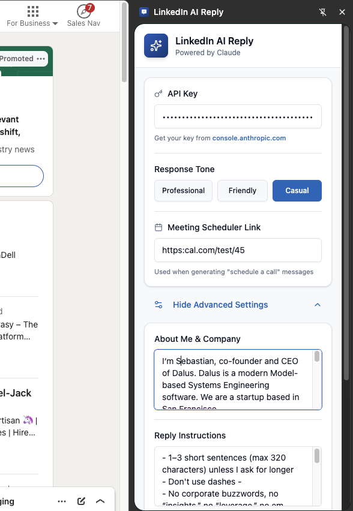
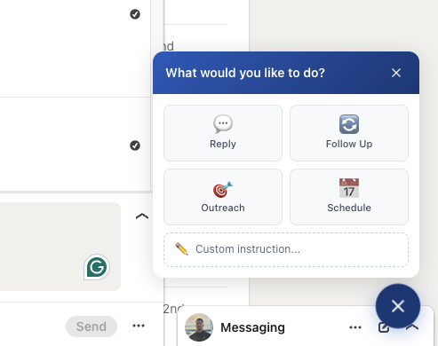
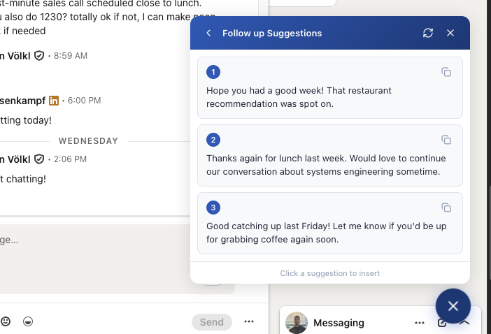

# LinkedIn AI Reply

AI-powered reply suggestions for LinkedIn messages using Claude API. Generate professional, contextual responses for LinkedIn conversations with a single click.

## Features

- **Smart Reply Generation**: Generate intelligent replies based on conversation context
- **Multiple Tone Options**: Choose between professional, friendly, or casual tones
- **Quick Actions**: Pre-built actions for common scenarios:
  - Reply to messages
  - Follow up on conversations
  - Schedule calls (with meeting link integration)
  - Cold outreach messages
- **Conversation Context**: Analyzes entire conversation history for relevant responses
- **Customizable**: Add your own context, instructions, and outreach templates
- **Keyboard Shortcuts**: `Ctrl+Shift+A` to quickly access the AI assistant
- **Side Panel UI**: Clean, intuitive settings interface

## Screenshots

### Settings Panel
Configure your API key, response tone, meeting link, and advanced settings.



### Quick Actions
Choose from Reply, Follow Up, Schedule, or Outreach actions with one click.



### AI Suggestions
Get multiple contextual message suggestions tailored to your conversation.



## Prerequisites

- Chrome browser (or Chromium-based browser)
- Claude API key from [Anthropic Console](https://console.anthropic.com/settings/keys)

## Installation

### Option 1: Install from Source (Development)

1. Clone this repository:
```bash
git clone https://github.com/sebastianvkl/linkedin-ai.git
cd linkedin-ai
```

2. Install dependencies:
```bash
npm install
# or
yarn install
```

3. Build the extension:
```bash
npm run build
# or
yarn build
```

4. Load the extension in Chrome:
   - Open Chrome and navigate to `chrome://extensions/`
   - Enable "Developer mode" (toggle in top-right corner)
   - Click "Load unpacked"
   - Select the `build/chrome-mv3-prod` folder

### Option 2: Development Mode

For development with hot reload:

```bash
npm run dev
# or
yarn dev
```

Then load the `build/chrome-mv3-dev` folder in Chrome.

## Setup

1. **Get Claude API Key**:
   - Visit [Anthropic Console](https://console.anthropic.com/settings/keys)
   - Create a new API key
   - Copy the key (starts with `sk-ant-...`)

2. **Open Extension Settings**:
   - Click the extension icon in Chrome toolbar
   - Or navigate to LinkedIn and the side panel will be available

3. **Configure Basic Settings**:
   - **API Key**: Paste your Claude API key
   - **Response Tone**: Select your preferred tone (Professional/Friendly/Casual)
   - **Meeting Link**: (Optional) Add your Calendly or meeting scheduler link

4. **Configure Advanced Settings** (Optional):
   - **About Me & Company**: Describe yourself and your company for more relevant replies
   - **Reply Instructions**: Add custom rules for generating replies
   - **Outreach Template**: Define rules for cold outreach messages

5. **Save & Test**:
   - Click "Save Settings"
   - Click "Test" to verify your API connection

## Usage

### On LinkedIn Messaging

1. Navigate to [LinkedIn Messaging](https://www.linkedin.com/messaging/)
2. Open any conversation
3. You'll see an AI sparkle button (✨) in the bottom-right corner
4. Click the button or press `Ctrl+Shift+A`
5. Select a quick action:
   - **Reply**: Generate a contextual reply to the last message
   - **Follow Up**: Create a follow-up message for inactive conversations
   - **Schedule Call**: Generate a message to schedule a meeting
   - **Outreach**: Create a cold outreach message (for new conversations)
6. Review the suggestions and click one to insert it into the message box
7. Edit if needed and send

### On LinkedIn Feed

The extension also works on LinkedIn posts to help you write engaging comments!

### Keyboard Shortcuts

- `Ctrl+Shift+A`: Open/close the AI assistant
- `Escape`: Close the suggestions panel

## How It Works

1. **Context Analysis**: The extension reads the current conversation on LinkedIn, extracting:
   - Message history
   - Sender/recipient information
   - Timestamps
   - Conversation state (active/inactive)

2. **AI Generation**: Sends the context to Claude API with:
   - Your configured tone and preferences
   - Custom instructions and context
   - The selected action type
   - Conversation history

3. **Smart Suggestions**: Claude generates 2-3 contextually relevant message suggestions

4. **One-Click Insert**: Click a suggestion to automatically insert it into the LinkedIn message box

## Tech Stack

- **Framework**: [Plasmo](https://www.plasmo.com/) - Modern browser extension framework
- **UI**: React 18 + TypeScript
- **Styling**: Tailwind CSS + Radix UI components
- **AI**: Anthropic Claude API (Sonnet 4)
- **Storage**: Chrome Storage API via Plasmo Storage

## Project Structure

```
linkedin-ai/
├── assets/              # Extension icons and assets
├── background/          # Background scripts and message handlers
│   └── messages/        # API message handlers
├── components/          # React UI components
│   └── ui/             # Reusable UI components
├── contents/           # Content scripts
│   ├── linkedin-feed.tsx
│   └── linkedin-messaging.tsx
├── lib/                # Utility functions and helpers
├── sidepanel.tsx       # Settings side panel
├── style.css           # Global styles
└── package.json        # Dependencies and config
```

## Development

### Run in development mode:
```bash
npm run dev
```

### Build for production:
```bash
npm run build
```

### Package for distribution:
```bash
npm run package
```

## Privacy & Security

- Your Claude API key is stored locally in Chrome's storage
- No data is sent to third-party servers except:
  - Direct API calls to Anthropic's Claude API
  - Conversation context is sent to Claude for generating responses
- The extension only accesses LinkedIn pages when you're actively using it
- Open source - you can review all code

## Troubleshooting

### Extension doesn't appear on LinkedIn
- Make sure you've loaded the extension in Chrome
- Refresh the LinkedIn page
- Check that the extension is enabled in `chrome://extensions/`

### API Connection Fails
- Verify your API key is correct
- Check you have API credits in your Anthropic account
- Click "Test" in settings to diagnose the issue

### Suggestions Don't Insert
- Use the "Copy" button as a fallback
- Some LinkedIn layouts may block automatic insertion
- Paste manually if needed

## Contributing

Contributions are welcome! Please feel free to submit a Pull Request.

## License

MIT License - feel free to use this project for personal or commercial purposes.

## Credits

Built with:
- [Plasmo Framework](https://www.plasmo.com/)
- [Anthropic Claude API](https://www.anthropic.com/)
- [Radix UI](https://www.radix-ui.com/)
- [Tailwind CSS](https://tailwindcss.com/)

---

**Note**: This is an unofficial extension and is not affiliated with LinkedIn or Anthropic.
